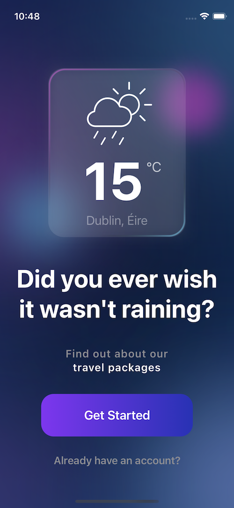

# Glassmorphism 
Simple app that shows the glassmorphism style that is quite popular these days.

### Bonus

The new SwiftUI AttributedString was used to format some of the text.

Tutorial by [Kavsoft](https://youtu.be/LbpGjAJRhLM)
