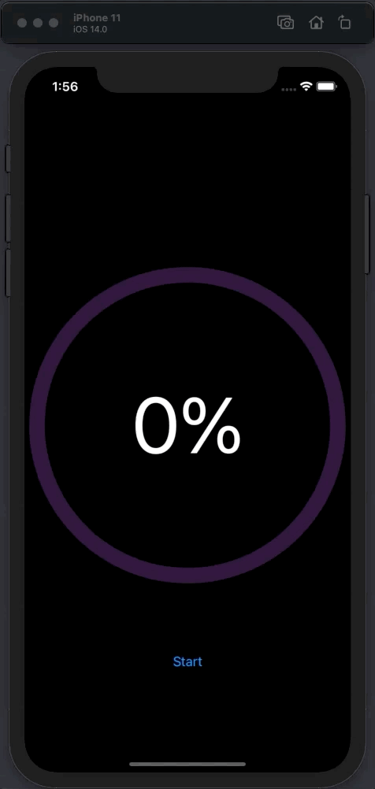

# Circular Progress Ring
Example for making a circular progress ring in SwiftUI

This is a simple app that demonstrates making a circular progress ring in SwiftUI 2 for iOS 14 and macOS 11. 

Inspiration from <a href="https://www.youtube.com/user/azamsharp/">Azam Sharp</a>.

