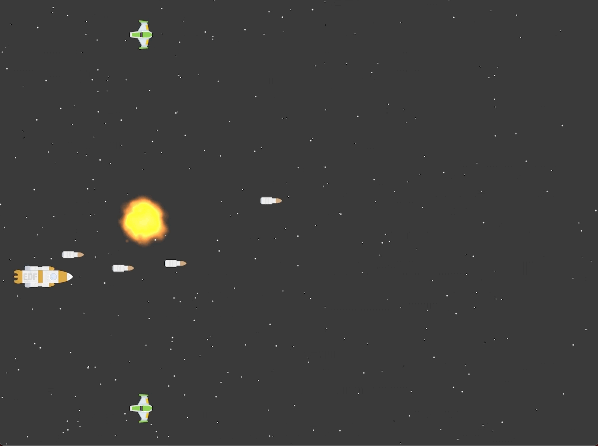

# Zaptastic Game
Example iPad game using SpriteKit. 

This is a simple 2D side-scrolling space-shooter game that uses the iPad gyroscope to control movement. 

It features: 

* CoreMotion
* Physics 
* Particle effects
* Auto-generated enemy formations and attack patterns

From <a href="https://youtu.be/0-lM51yI-PA">HackingWithSwift</a>.

The sprites were sourced from From <a href="https://https://kenney.nl">Kenney.nl</a>

 
