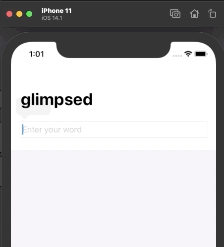

# WordScramble App
Example app for SwiftUI & CoreML

This is a simple app game that shows a random 8-letter word, and the user tries to make new words out of the letters given. 

It also introduces: 

* List
* Using URL for files in the app bundle
* Working with Strings
* onAppear
* How to handle errors with fatalError()

From <a href="https://www.hackingwithswift.com/books/ios-swiftui/word-scramble-introduction">HackingWithSwift</a>.

