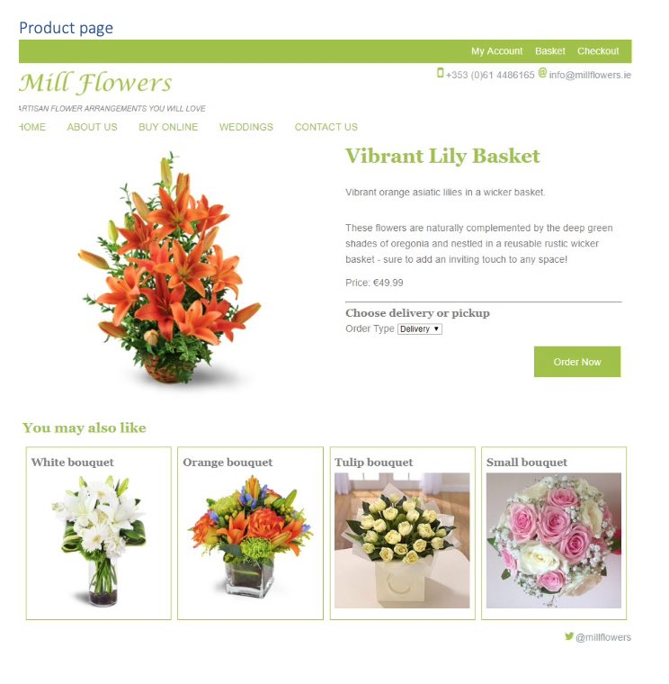
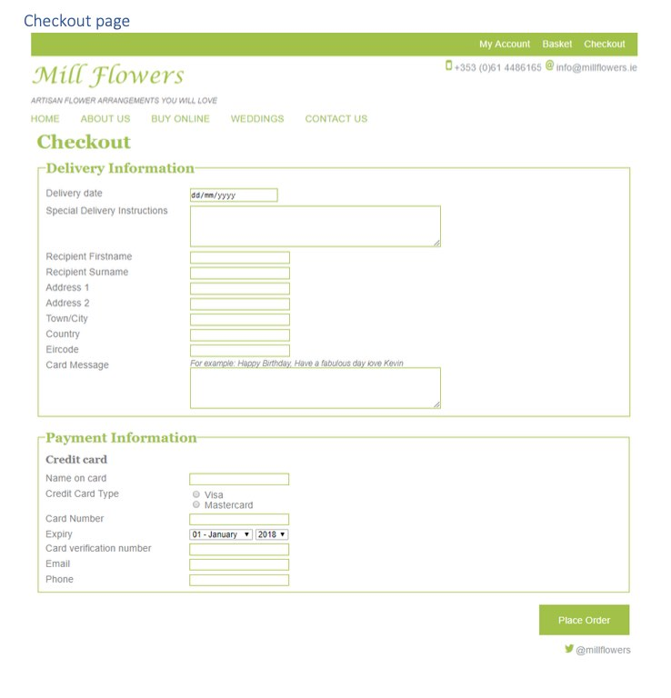
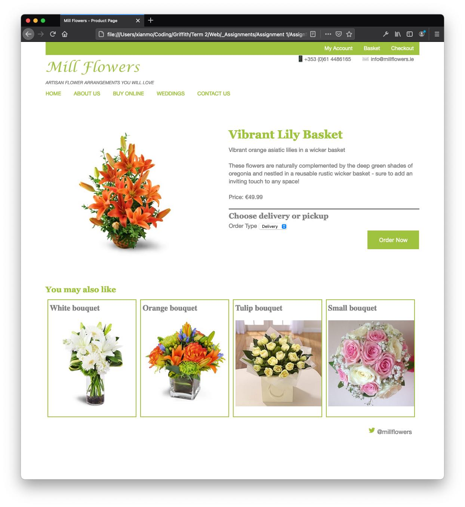
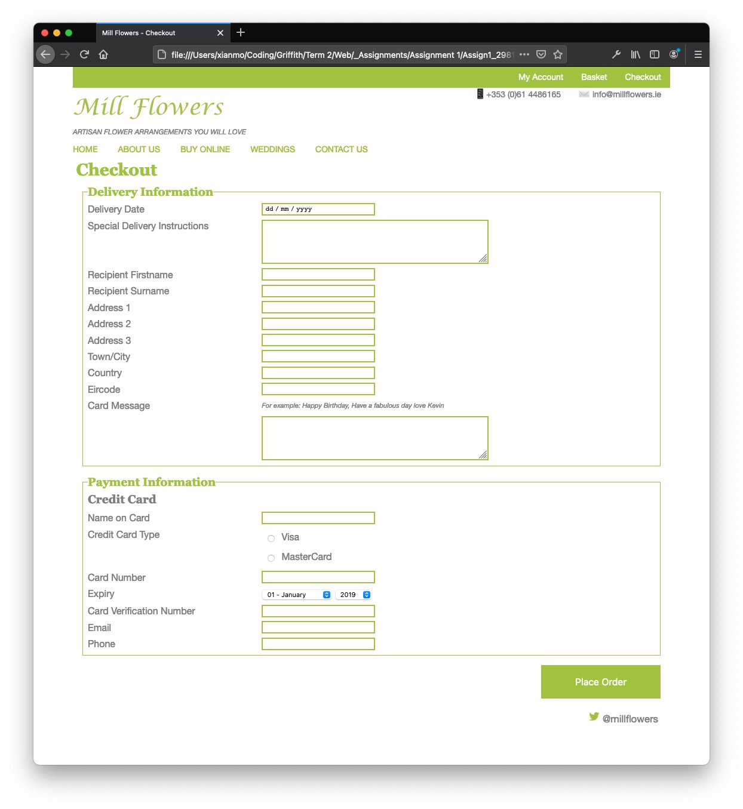

# Web Development Assignment 1

This was the first web development assignment.

Some of the topics or tools used included: 

* HTML 5
* CSS 3
* Bootstrap
* PHPStorm

The instructor provided static images of a sample webpage, and we were tasked to re-create the product and checkout pages. 

Provided images: 

My submission: 

