# Web Development Assignment 2

This was the second web development assignment.

Some of the topics or tools used included: 

* HTML 5
* CSS 3
* Bootstrap
* Responsive design
* PHPStorm

As before, the instructor provided static images of a sample webpage, and we were tasked to re-create the about, category and home pages. The pages should also have a responsive design, and automatically resize and change layout when viewed on a mobile. 

Provided images: 
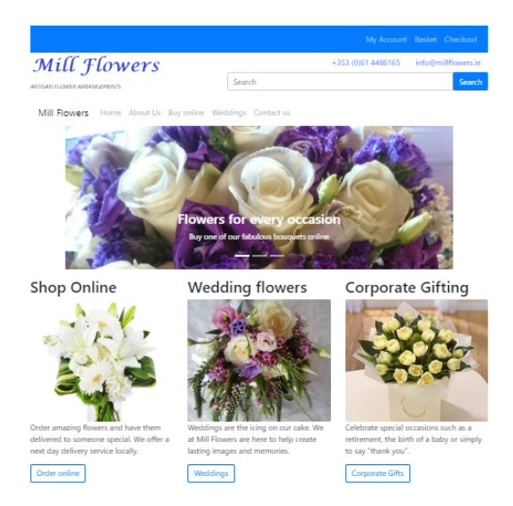
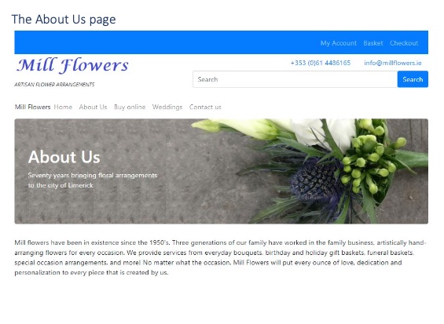
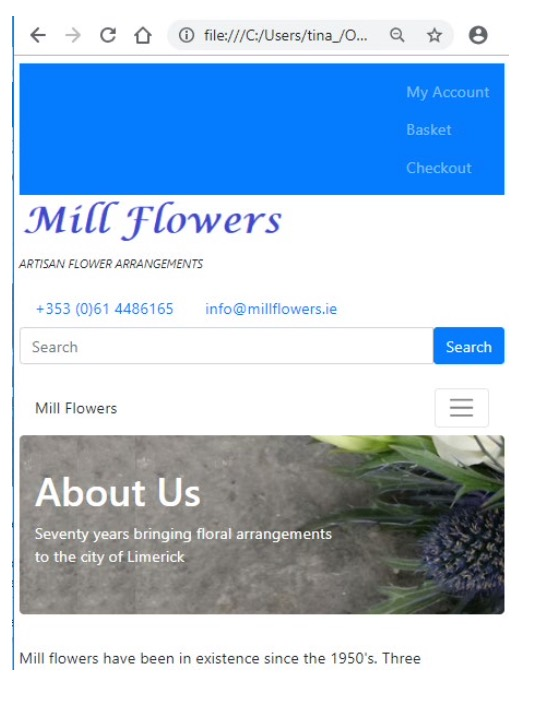
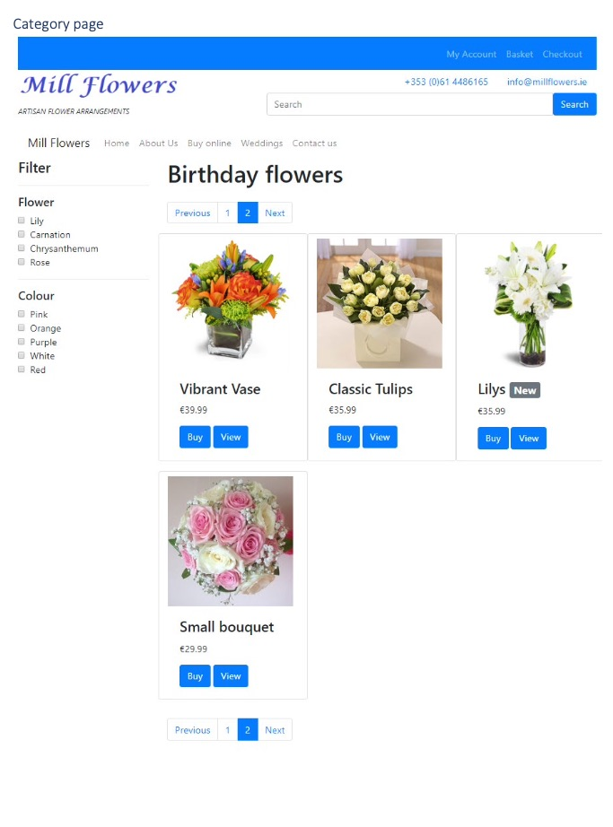
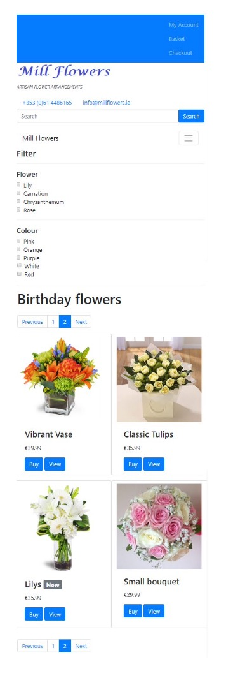

My submission: 
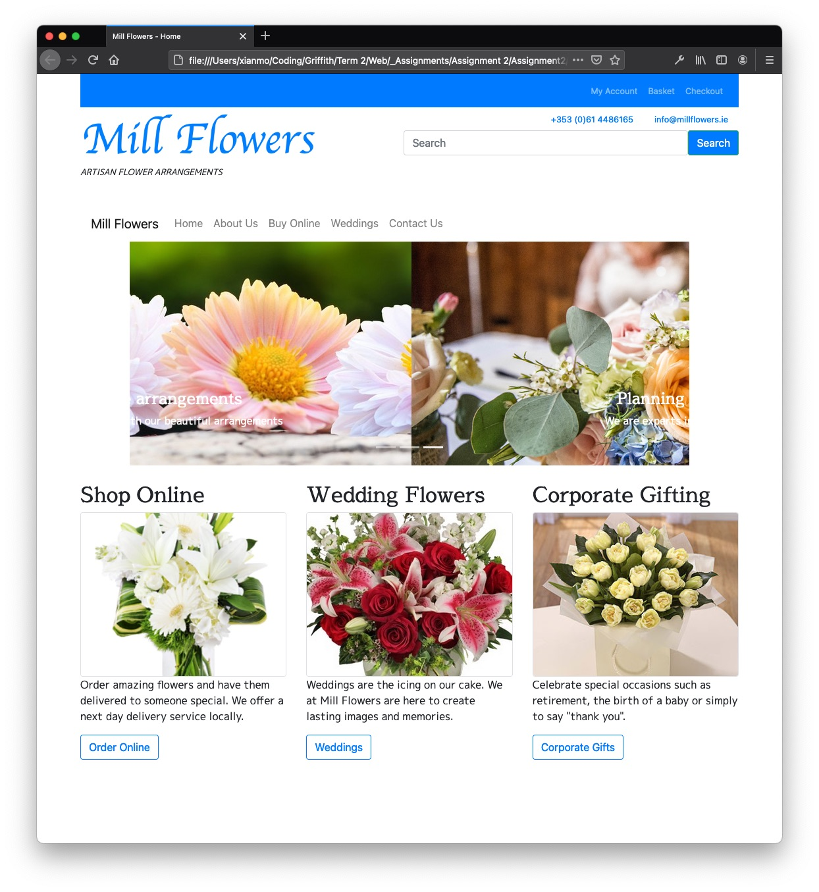
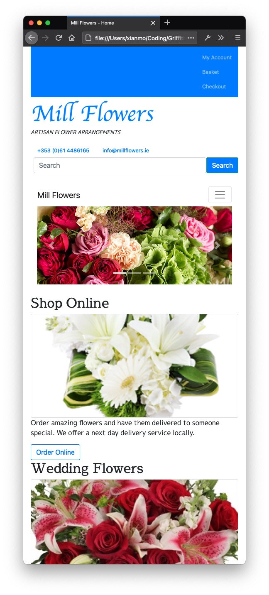
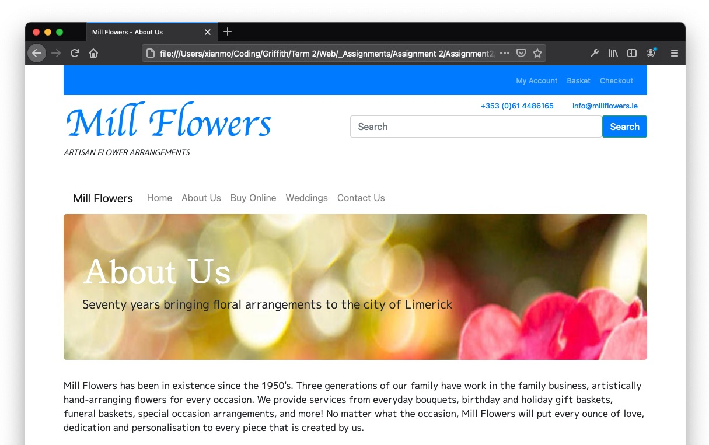
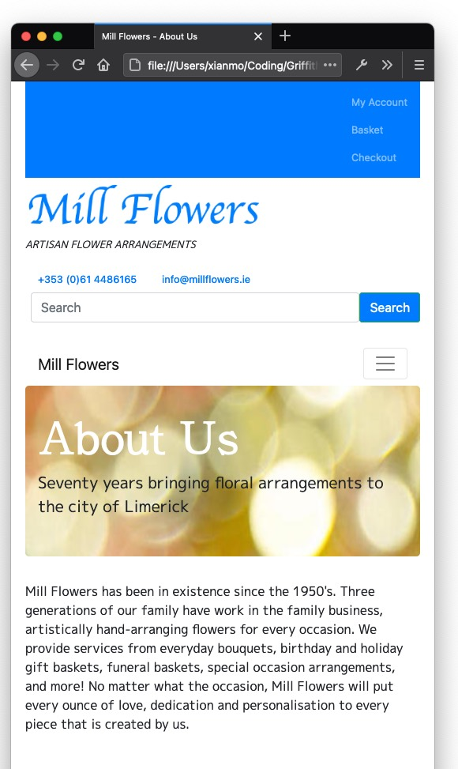
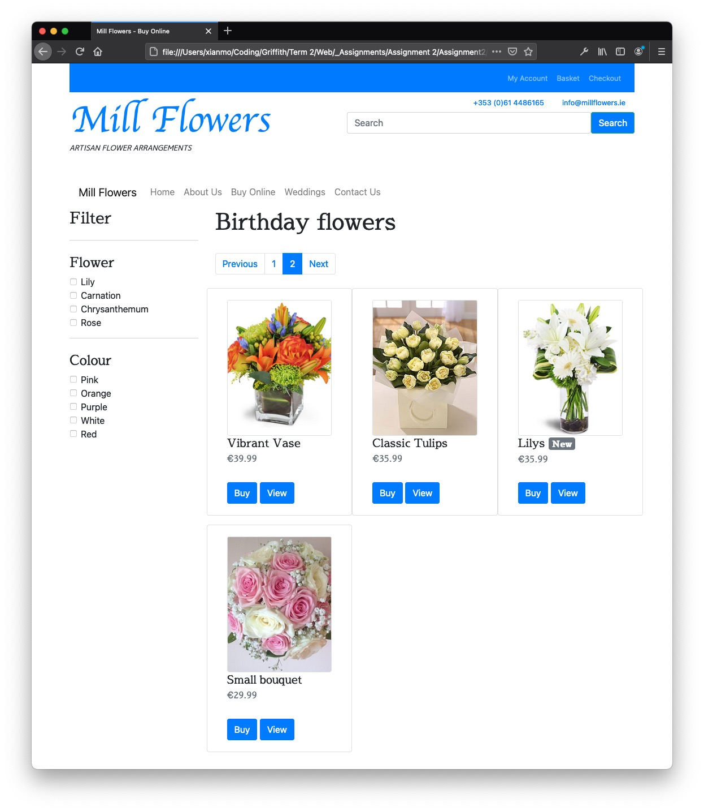
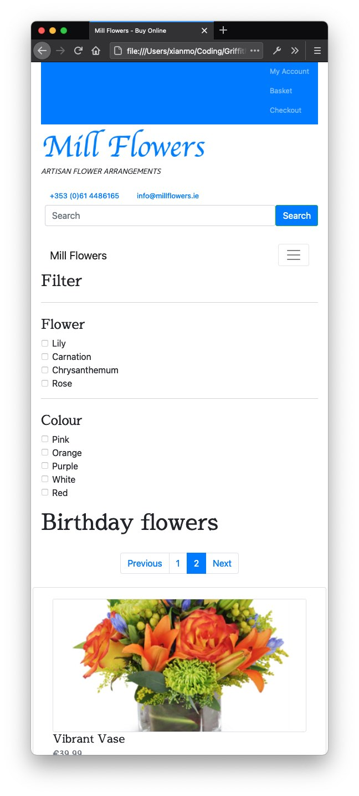
